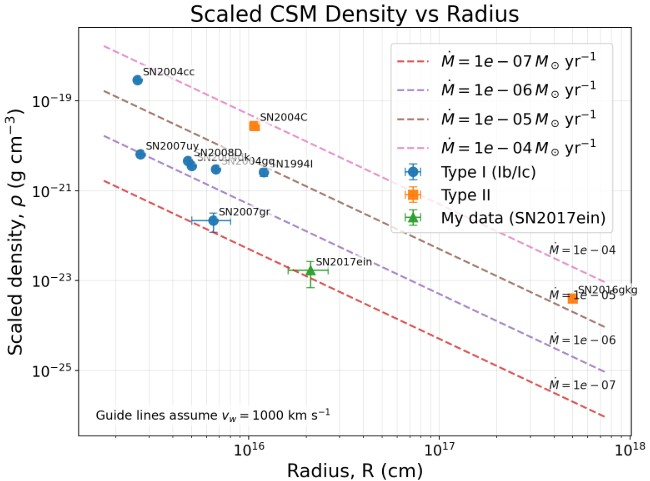

# Radio Modelling of the Circumstellar Medium around SN 2017ein

This repository contains the code, plots, and final report for my final-year Physics with Astrophysics research project on radio modelling of the circumstellar medium (CSM) around the Type Ic supernova **SN 2017ein**.

The aim of the project was to use radio observations to estimate the physical properties of material surrounding the supernova. This material was ejected by the progenitor system before explosion, so modelling it can help constrain the late-stage mass-loss history of the star.

## Project overview

SN 2017ein is a stripped-envelope Type Ic supernova in NGC 3938. Type Ic supernovae show no strong hydrogen or helium features in their spectra, implying that the progenitor lost its outer layers before core collapse, either through stellar winds, binary interaction, or both.

In this project, I analysed radio data from the Karl G. Jansky Very Large Array (VLA). The radio emission is interpreted as synchrotron radiation produced when the supernova shock expands into the surrounding CSM. I modelled the radio spectral energy distribution (SED) using a synchrotron self-absorption (SSA) framework, following the methodology of DeMarchi et al. (2022).

## Method

The main workflow was:

1. Clean VLA radio images using CASA `tclean`.
2. Measure the supernova flux density in each image using CASA `imfit`.
3. Construct a radio SED from the measured fluxes.
4. Fit the SED with a smooth broken power law SSA model.
5. Extract the break flux, break frequency, and optically thin spectral slope.
6. Use the fitted SSA parameters to estimate physical quantities such as magnetic field strength, shock radius, CSM density, and mass-loss rate.
7. Compare SN 2017ein with other radio supernovae using literature values.

## Main results

The best-fitting SSA model gave:

- Break flux: **F_brk = 1.54 ± 0.07 mJy**
- Break frequency: **ν_brk = 1.6 ± 0.2 GHz**
- Optically thin slope: **α₂ = −1.2 ± 0.2**
- Electron energy index: **p = 3.3 ± 0.3**

Using these fitted values, the derived equipartition parameters were approximately:

- Magnetic field strength: **B = 0.20 ± 0.03 G**
- Shock radius: **R = (2.1 ± 0.5) × 10¹⁶ cm**
- CSM density: **ρ_CSM = (1.7 ± 1.0) × 10⁻²³ g cm⁻³**
- Mass-loss scaling: **Mdot / v_w = (9.4 ± 3.0) × 10¹⁰ g cm⁻¹**

These values suggest that SN 2017ein is consistent with a relatively low-density CSM compared with several other radio supernovae in the comparison sample. However, the result is based on a single radio epoch and depends on assumptions about SSA dominance, equipartition, wind velocity, and shock microphysics.

## Density comparison plot

The plot below compares the scaled CSM density of SN 2017ein with other radio supernovae as a function of shock radius.



In this comparison, SN 2017ein lies toward the lower-density region of the sample. This is consistent with a relatively clean or low-density local environment, though the interpretation should remain cautious because different studies use different assumptions and some literature values are not directly equivalent.

## Repository structure

```text
.
├── README.md
├── Final_Year_Physics_Project___Final_Report.pdf
├── DeMarchieqns.ipynb
├── SED.ipynb
├── Comparisoonplots.ipynb
└── plots/
    ├── DensityPlotFix.jpg
    ├── Bplot.png
    ├── masslossrate.png
    └── Shockvplot.png
```

## Notebooks

### `SED.ipynb`

Builds the radio spectral energy distribution from the measured flux densities. It plots the radio fluxes, handles the selected detections and non-detections, and fits a smooth broken power law SSA model to estimate the break flux, break frequency, and spectral slope.

### `DeMarchieqns.ipynb`

Implements the SSA physical parameter equations adapted from DeMarchi et al. (2022). This notebook converts the fitted SED parameters into estimates of magnetic field strength, shock radius, CSM density, and mass-loss scaling. It also includes uncertainty propagation for the derived quantities.

### `Comparisoonplots.ipynb`

Collects literature values for a small sample of radio supernovae and compares them with SN 2017ein. It produces comparison plots for CSM density, mass-loss rate, magnetic field strength, and shock velocity.

## Plots

The `plots/` folder contains the main figures generated from the analysis:

- `DensityPlotFix.jpg` — scaled CSM density versus shock radius
- `Bplot.png` — magnetic field strength comparison
- `masslossrate.png` — mass-loss rate comparison
- `Shockvplot.png` — shock velocity comparison

## Scientific context

The interpretation of SN 2017ein is still evolving. Earlier studies suggested that a luminous pre-explosion source could be a massive Wolf-Rayet progenitor or binary system. More recent late-time HST observations suggest that this source did not disappear, meaning it may not have been the true progenitor. This project therefore treats the radio-derived CSM properties as a way to probe the environment around the explosion without overclaiming a specific progenitor channel.

## Key references

- DeMarchi et al. (2022), radio SSA modelling of SN 2004C
- Kilpatrick et al. (2018), proposed progenitor candidate for SN 2017ein
- Xiang et al. (2019), shock-cooling and early-time observations of SN 2017ein
- Zhao et al. (2025), late-time HST constraints on the proposed progenitor candidate

## Notes

This project was completed as a final-year undergraduate Physics with Astrophysics research project. The numerical values should be treated as project-level results rather than final published constraints, especially because the modelling uses a limited radio dataset and several standard assumptions from radio supernova theory.
